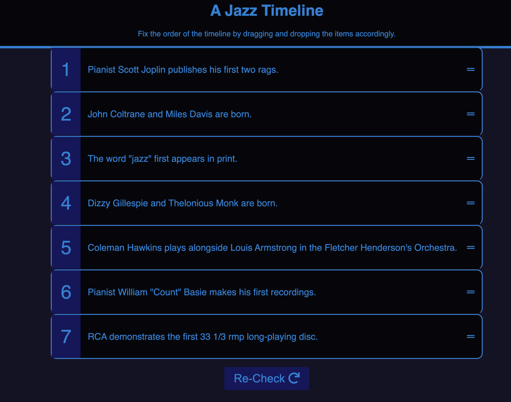
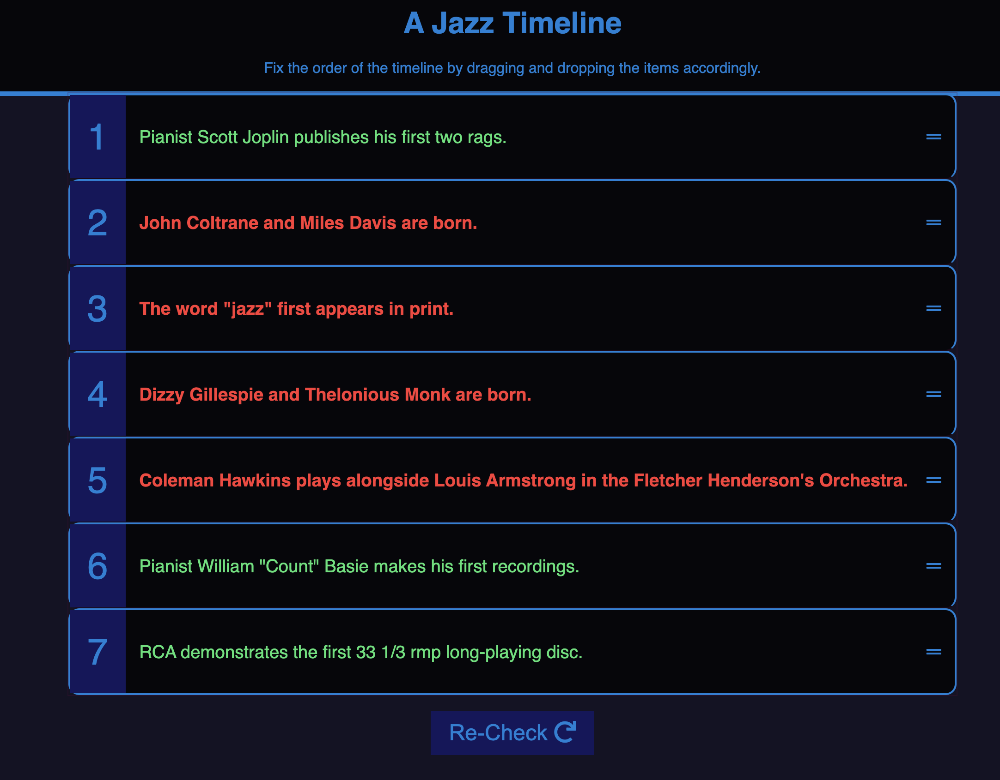
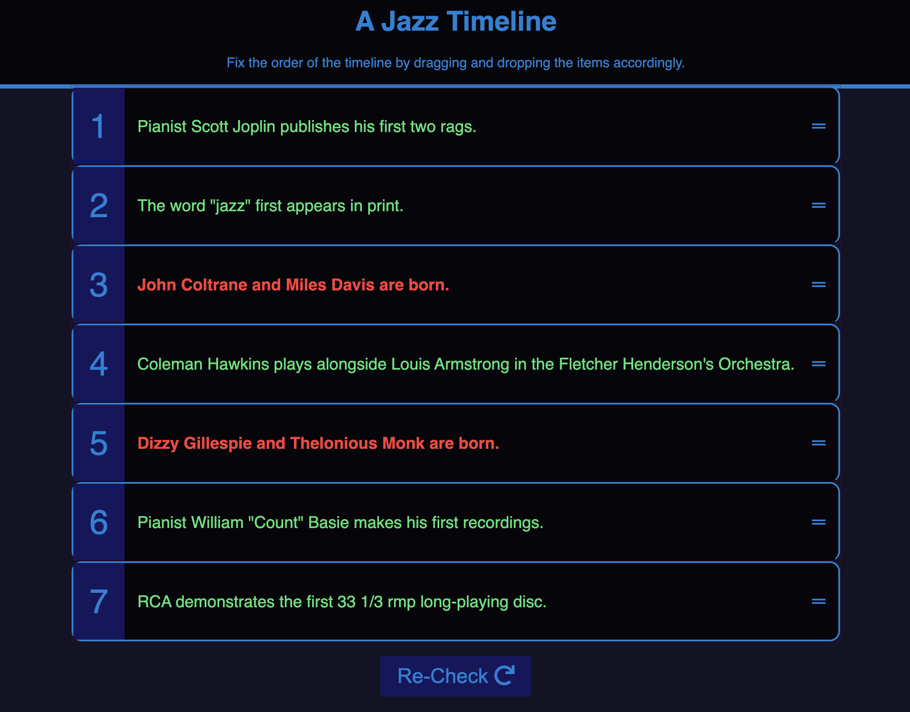
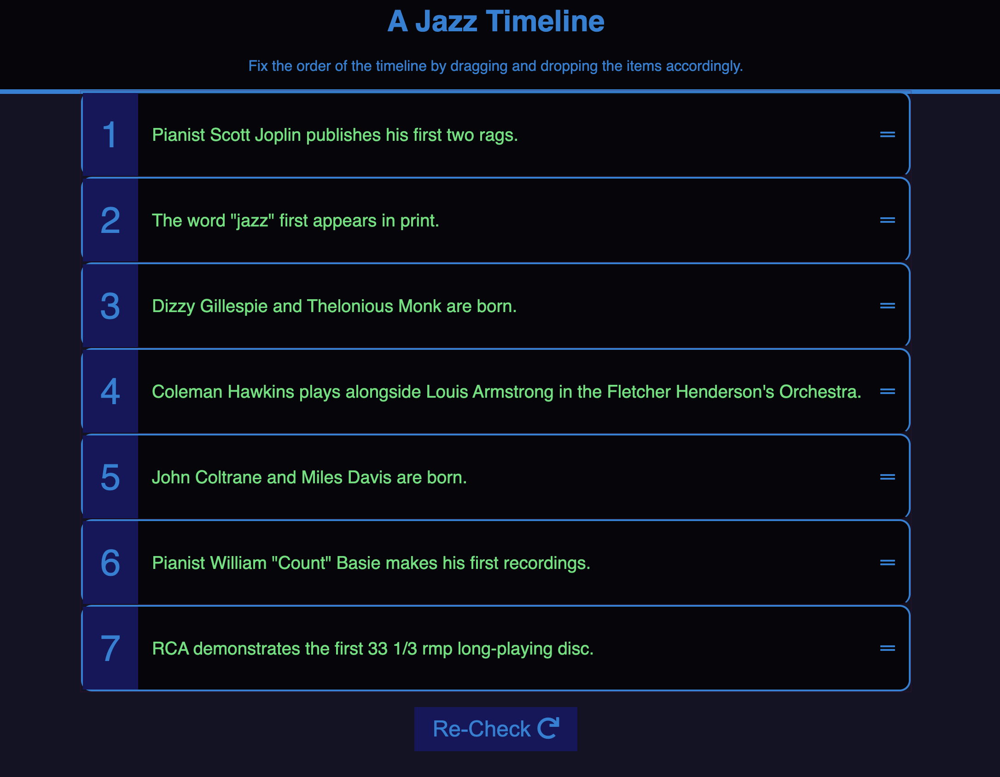

# Drag and Drop Jazz

Simple but effective drag and drop like with order checker for many use cases, namely studying / TechED implementations.

### Snippets of some JS blocks used in this project: 

```js
function addEventListeners() {
  const draggables = document.querySelectorAll('.draggable');
  const dragListItems = document.querySelectorAll('.draggable-list li');
  draggables.forEach(draggable => {
    draggable.addEventListener('dragstart', dragStart);
  });

  dragListItems.forEach(item => {
    item.addEventListener('dragover', dragOver);
    item.addEventListener('drop', dragDrop);
    item.addEventListener('dragenter', dragEnter);
    item.addEventListener('dragleave', dragLeave);
  });
}
```

```js
listItem.querySelector('.draggable').innerText.trim();

listItem.querySelector

+this.getAttribute(
```

```js
.map(a => ({ value: a, sort: Math.random() }))
    .sort((a, b) => a.sort - b.sort)
    .map(a => a.value)
    .forEach((person, index) => {
```






## Contact


__Jon Christie__ 

GitHub: [mathcodes](https://github.com/mathcodes) 

[<code></code>](https://www.linkedin.com/jonchristie)       
[<code></code>](https://twitter.com/jonpchristie)       
[<code></code>](https://www.youtube.com/channel/UC5GFnN-lv8Yuqc9O3b79k6g)       
[<code></code>](https://www.facebook.com/jonpchristie)       
[<code></code>](https://www.instagram.com/fullstack11235)       
[<code></code>](https://soundcloud.com/jonchristie#/)       
[<code></code>](https://open.spotify.com/artist/07S7aLfxH70VAX64g1WuFw?si=tlOj1OMBRLm-y4sY8Lox3Q)     
